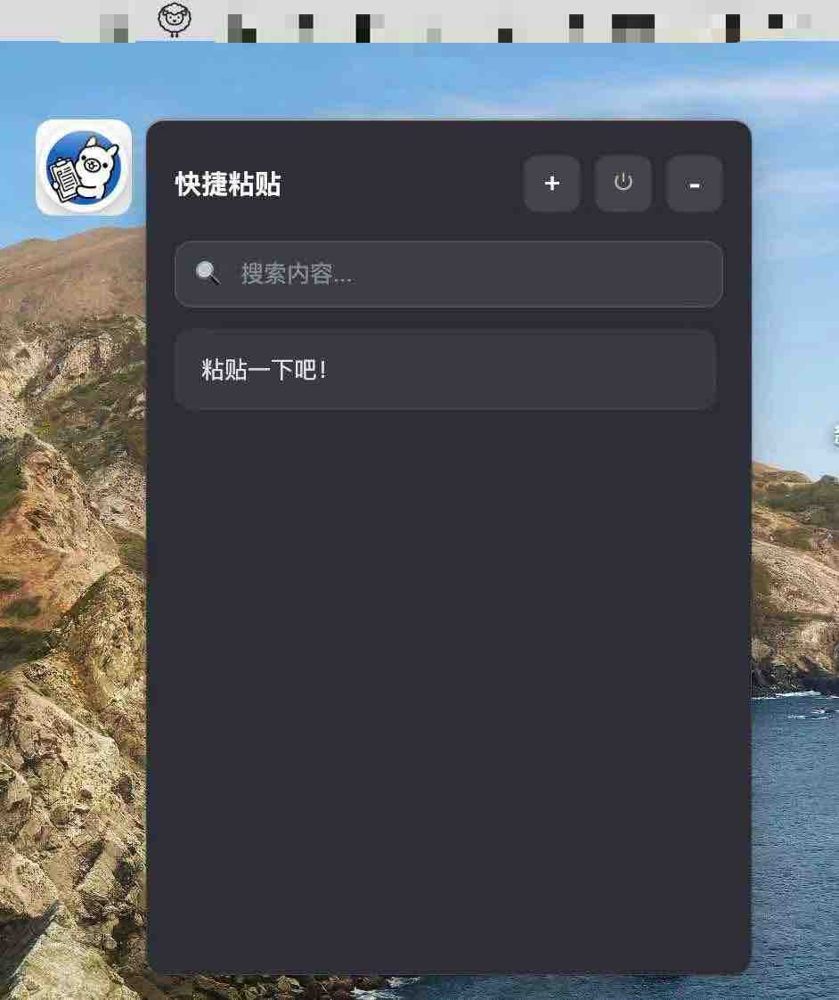
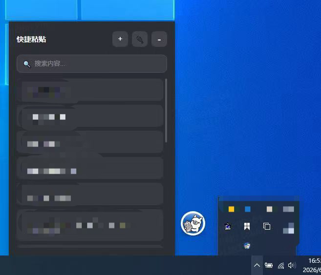

# NianYiTuo — 悬浮球快捷粘贴工具

一个轻量级的桌面快捷粘贴工具，通过悬浮球快速访问常用文本片段。基于 Electron + Vue 3 构建。

## 预览

| macOS | Windows |
|:---:|:---:|
|  |  |

## 功能特性

- ✅ 桌面悬浮球，可自由拖动（无留白）
- ✅ 点击悬浮球展开/关闭快捷文本面板
- ✅ 一键复制到剪贴板
- ✅ 添加、编辑、删除快捷文本（无需标题，直接保存内容）
- ✅ 模糊搜索过滤
- ✅ 面板可拖拽移动、自动吸边
- ✅ 系统设置窗口
  - 开机自启（独立页，写入注册表 / 登录项）
  - 数据导入导出（JSON 备份，支持合并 / 覆盖两种模式，方便换电脑迁移）
- ✅ 本地持久化存储（electron-store）
- ✅ 深色主题，简洁现代的 UI 设计
- ✅ 支持 Windows 和 macOS

## 平台差异

| 功能 | macOS | Windows |
|------|-------|---------|
| 悬浮球跳跃动画 | ✅ 每 5 秒自动弹跳 | ❌ 不启用 |
| 退出按钮图标 | ⏻ | 🔌 |
| 应用图标格式 | .png | .ico |
| 打包格式 | DMG / ZIP | NSIS 安装器 |
| 窗口关闭行为 | 不退出应用（保留在 Dock） | 直接退出应用 |
| 开机自启机制 | 登录项 | 注册表 `HKCU\...\Run` |

> 平台检测统一用 `process.platform === 'darwin'`，渲染进程通过 preload 暴露的 `getPlatform()` 获取。

## 快速开始

### 1. 安装依赖

```bash
cd electron-quick-paste
npm install
```

### 2. 开发模式

```bash
npm run dev
```

启动 electron-vite dev server，自动打开悬浮球窗口。改动 `src/` 下代码会热更新。

### 3. 使用方法

**悬浮球 / 面板**
1. **拖动悬浮球**：按住悬浮球拖动到屏幕任意位置，松手自动吸边（macOS）
2. **点击悬浮球**：展开/关闭快捷文本面板
3. **复制文本**：点击列表项自动复制到剪贴板
4. **添加文本**：面板右上角 `+` 按钮，弹窗中输入内容，`Ctrl+Enter` 快捷保存
5. **编辑/删除**：悬停列表项显示 `✎` 和 `✕` 按钮
6. **搜索**：搜索框输入关键词模糊过滤
7. **移动面板**：拖拽面板标题栏
8. **收起面板**：点击 `-` 按钮（面板隐藏，悬浮球仍在）
9. **退出应用**：点击 `⏻` / `🔌` 按钮，确认后退出

**系统设置**（面板右上角 `⚙` 按钮）
1. **开机启动**：开关切换，写入/删除注册表（Windows）或登录项（macOS）
2. **数据管理**：
   - **导出数据**：把所有 snippets 保存为 JSON 文件
   - **导入数据**：从 JSON 文件导入，可选两种模式
     - 合并（默认）：跳过重复内容，追加新内容
     - 覆盖：清空当前数据后导入（不可恢复）

> 设置窗口的侧边栏和顶部标题栏支持拖拽移动（`-webkit-app-region: drag`）。

## 项目结构

```
electron-quick-paste/
├── src/
│   ├── main/                    主进程
│   │   ├── index.ts             入口（生命周期、单实例锁、显示器适配）
│   │   ├── tray.ts              托盘菜单
│   │   ├── windows/
│   │   │   ├── ball.ts          悬浮球窗口（含跳跃动画）
│   │   │   ├── panel.ts         面板窗口（含拖拽 + 弹簧吸附）
│   │   │   └── settings.ts      设置窗口
│   │   ├── ipc/
│   │   │   ├── index.ts          IPC 汇总注册
│   │   │   ├── snippets.ts       增删改查 + 剪贴板
│   │   │   ├── window-drag.ts   拖拽 + 吸附 + 跳跃控制
│   │   │   ├── auto-launch.ts   开机自启
│   │   │   ├── settings.ts      设置窗口开关
│   │   │   └── data.ts           导入导出
│   │   └── lib/
│   │       ├── store.ts         electron-store 封装
│   │       ├── auto-launch.ts   auto-launch 单例
│   │       └── display.ts        多显示器查找
│   ├── preload/
│   │   ├── ball.ts              悬浮球 preload
│   │   ├── panel.ts             面板 preload
│   │   ├── settings.ts          设置 preload
│   │   └── index.d.ts          全局 ElectronAPI 类型声明
│   └── renderer/
│       ├── ball/                悬浮球页面
│       │   ├── index.html
│       │   ├── main.ts
│       │   └── App.vue
│       ├── panel/               面板页面
│       │   ├── index.html
│       │   ├── main.ts
│       │   ├── App.vue
│       │   └── stores/snippets.ts
│       └── settings/            设置页面
│           ├── index.html
│           ├── main.ts
│           ├── App.vue
│           ├── router.ts
│           └── pages/
│               ├── AutoLaunch.vue
│               └── DataManage.vue
├── build/                       打包资源
│   ├── icon.png                 通用图标
│   ├── tray-icon.png            托盘图标
│   └── installer.nsh            NSIS 卸载脚本（清缓存 + 删注册表）
├── out/                         构建产物（gitignore）
├── release/                     打包产物（gitignore）
├── electron.vite.config.ts      electron-vite 三进程构建配置
├── electron-builder.json        打包配置
├── tsconfig.json / tsconfig.node.json / tsconfig.web.json
└── package.json
```

## 开发命令

| 命令 | 说明 |
|---|---|
| `npm run dev` | 启动 dev server，热更新开发 |
| `npm run build` | electron-vite 构建（main + preload + renderer）到 `out/` |
| `npm run preview` | 预览构建产物 |
| `npm run typecheck` | 跑 TypeScript 类型检查（node + web 两套） |
| `npm run pack:win` | 构建 + 打 Windows NSIS 安装器到 `release/` |
| `npm run pack:mac` | 构建 + 打 macOS DMG/ZIP 到 `release/` |
| `npm run release` | 构建 + 打当前平台包 |

## 打包发布

### Windows

```bash
npm run pack:win
```

产物位于 `release/`：
- `NianYiTuo Setup <version>.exe` — NSIS 安装器，发给别人双击安装
- `win-unpacked/NianYiTuo.exe` — 免安装版，双击直接跑
- `*.blockmap` + `latest.yml` — electron-updater 自动更新用的（当前未启用）

### macOS

```bash
npm run pack:mac
```

产物位于 `release/`：DMG 和 ZIP。

### 打包注意事项

1. **首次打包会下载 winCodeSign 等工具**到 `~/.electron-builder`（约 100MB），之后缓存复用
2. **Windows 符号链接权限**：electron-builder 解压 winCodeSign 时会创建符号链接，需要：
   - 开启 Windows 开发者模式（推荐，一次配置永久生效）：设置 → 更新和安全 → 开发者选项 → 开发人员模式
   - 或用管理员身份运行打包命令
3. **dev 必须关闭**：打包前确认任务管理器里没有 `electron.exe` 进程，否则 `out/main/index.js` 文件占用导致打包失败
4. **ASAR 打包**：代码和 `dependencies` 依赖打进 `app.asar`，devDependencies 不进
5. **本地化**：`electron-builder.json` 配置 `!**/locales/!(zh-CN|en-US)*.pak`，但仅对 asar 内生效，win-unpacked 仍有完整 locales

## 技术栈

- **Electron 27** — 跨平台桌面应用框架
- **electron-vite 5** — 三进程（main / preload / renderer）构建工具
- **Vue 3** — 渲染进程 UI 框架（Composition API + SFC）
- **Pinia** — 状态管理（snippets store）
- **Vue Router** — 设置页内部子路由（memory history）
- **Naive UI** — 组件库，按需加载（unplugin-vue-components + NaiveUiResolver）
- **TypeScript** — 类型安全（分 node / web 两套 tsconfig）
- **electron-store** — 本地数据持久化
- **auto-launch** — 开机自启
- **electron-builder** — 打包

## 数据存储

### 数据文件位置

| 模式 | 路径 |
|---|---|
| dev | `%APPDATA%\electron-quick-paste\quick-paste-data.json` |
| 打包后 | `%APPDATA%\NianYiTuo\quick-paste-data.json` |
| macOS | `~/Library/Application Support/NianYiTuo/quick-paste-data.json` |

> dev 模式下目录名是 `electron-quick-paste`（package.json 的 name 字段），打包后是 `NianYiTuo`（productName）。这是 Electron 默认行为，不影响功能。

### 存储字段

```json
{
  "snippets": [
    { "id": 1, "content": "..." }
  ],
  "ballPosition": { "x": 1866, "y": 215 },
  "panelPosition": { "x": 25, "y": 310 }
}
```

- `snippets` — 快捷文本列表
- `ballPosition` / `panelPosition` — 窗口位置（首次启动为 null，拖拽后保存）

> 开机自启状态**不在** store 里，直接读写注册表 / 登录项。

### 换电脑迁移

1. 旧设备：设置 → 数据管理 → 导出数据 → 保存 JSON 文件
2. 新设备：安装 NianYiTuo → 设置 → 数据管理 → 选合并或覆盖 → 导入 JSON
3. panel 列表会自动刷新显示导入内容

## 注意事项

1. **macOS 权限**：首次运行可能需要在"系统偏好设置 > 安全性与隐私"中允许应用
2. **Windows Defender**：可能会误报，选择"仍要运行"即可
3. **Windows DPI 缩放**：面板拖拽用 `setBounds()` 而非 `setPosition()`，防止 DPI 缩放导致窗口尺寸漂移；Windows 下强制 `force-device-scale-factor=1`
4. **dev 模式开机自启**：`app.getPath('exe')` 返回 `electron.exe` 路径，注册的是 electron 而不是 NianYiTuo，开机不会真正启动应用。**开机自启必须在打包版验证**

## 卸载

### Windows
- "设置 → 应用 → 已安装的应用 → NianYiTuo → 卸载"
- 或从开始菜单找 "Uninstall NianYiTuo"
- 卸载会自动：
  - 删除注册表 `HKCU\...\Run\NianYiTuo`（installer.nsh 的 `customUnInstall` 宏）
  - 清空 `%APPDATA%\NianYiTuo` 和 `%LOCALAPPDATA%\NianYiTuo` 缓存

### macOS
1. 托盘图标 → "退出"，确保应用已退出
2. 在"应用程序"中拖 NianYiTuo 到废纸篓，清空废纸篓
3. 残留用户数据（可选清理）：
   - `~/Library/Application Support/NianYiTuo/`
   - `~/Library/Preferences/com.quickpaste.app.plist`
   - `~/Library/Caches/NianYiTuo/`
   - `~/Library/Logs/NianYiTuo/`
4. 或用 AppCleaner 等第三方工具，拖 .app 进去自动清理

## 升级（Windows）

- 双击新版 Setup.exe 覆盖安装即可，用户数据（snippets、窗口位置、开机自启状态）会保留
- 若安装时应用正在运行，会提示手动关闭应用后继续
- 降级安装旧版本会被允许，无特殊提示

## 遇到的难题

### Electron 无边框窗口在高 DPI 下的稳定拖拽

Windows 高 DPI 环境（125% / 150% 缩放）和高刷新率鼠标条件下，如果改用 JavaScript 通知主进程实现拖拽，容易出现拖拽抖动、窗口尺寸异常变化、快速移动时拖拽中断等问题。

参考文章：[知乎作者-w0fv1.dev](https://zhuanlan.zhihu.com/p/1980462518976680377)

## Changelog

### 2.0.0
- 重构：迁移到 Vue 3 + TypeScript + electron-vite 架构
- 新增：独立系统设置窗口（`⚙` 按钮入口）
- 新增：开机自启独立页（从面板移到设置窗口）
- 新增：数据导入导出功能（JSON 备份，合并/覆盖两种模式）
- 新增：Naive UI 按需加载（n-switch 等组件）
- 修复：panel 列表无法滚动（CSS 高度链断裂）
- 修复：退出按钮漏绑 `@click`
- 改进：开机自启失败时返回错误信息，前端 toast 提示

### 1.2.1
- 旧架构（原生 JS + HTML）最后一版

## 许可证

MIT License

## 作者

zzc
